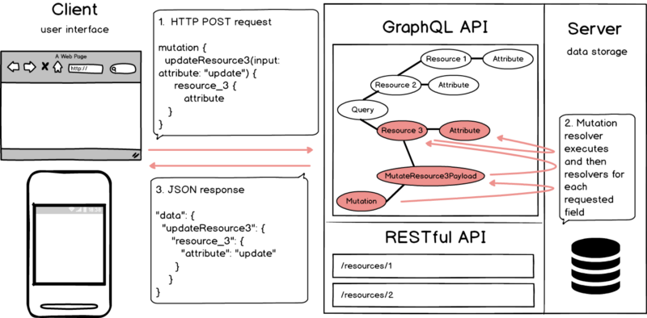

# +

- [GraphQL Playground](https://www.graphqlbin.com/v2/new)
- [GitHub \- swisskyrepo/GraphQLmap: GraphQLmap is a scripting engine to interact with a graphql endpoint for pentesting purposes\.](https://github.com/swisskyrepo/GraphQLmap)
- [PayloadsAllTheThings/GraphQL Injection at master \- swisskyrepo/PayloadsAllTheThings](https://github.com/swisskyrepo/PayloadsAllTheThings/tree/master/GraphQL%20Injection#enumerate-database-schema-via-introspection)

# overview

- data in a graph structure (versus by resources)
- one interface (versus multiple endpoints)
- type system
    - for each node an object type
- entrypoints
    - query
    - mutation

> Data exposed to the API is represented by a graph where objects are represented by nodes and relationships between these objects are described by edges.  GraphQL is a RESTful API and more: a type system defines all queryable data on one endpoint.  There is no mapping between functions implemented on the server and HTTP methods. Each object is backed by a resolver. The resolver is responsible for accessing the server’s data.

# case studies

- https://gitlab.com/osusec/damctf-2020/-/tree/master/web/there-is-no-war-in-graphql
- https://swisskyrepo.github.io/HIP19-MeetYourDoctor/
