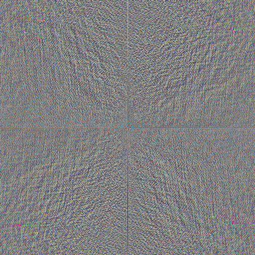
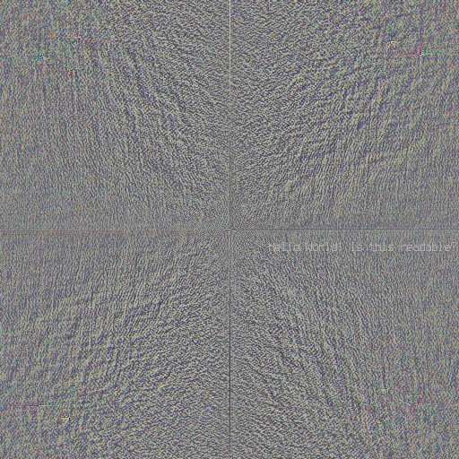
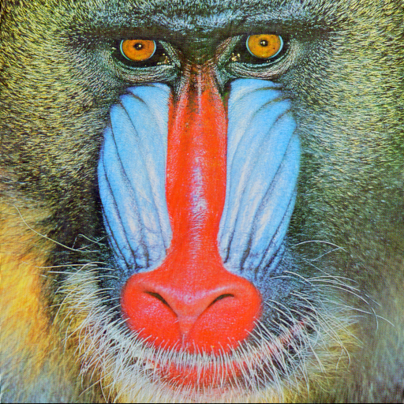
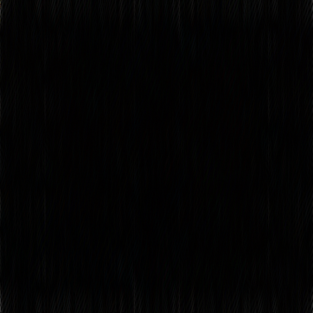
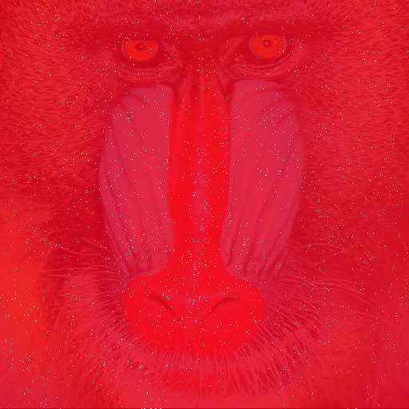

# fft-steg

This is just a silly experiment with [Fourier transforms using GIMP](http://www.zoyinc.com/?p=1529). Although the linked plugin is quite old, compiling it from source works fine with GIMP 2.10.

So the idea is to take this test image:

Apply `Filters > Generic > FFT Forward`:

Then type a message, minimizing possible artifacts by using a neutral grey foreground color (close to `#808080`), and a bitmap font (no other colours added from anti-aliasing):

After reverting with `Filters > Generic > FFT Inverse`:

At first glance, not that bad for a 512x512 image! However, if we compare with the original image, there's noticable lines near the bottom. Here, let me make it clearer with a `composite baboon.png baboon-fft-inv-msg.png -compose difference baboon.diff.png`:

Actually, it's even worse, most of the image was affected if we check with `compare baboon.png baboon-fft-inv-msg.png -metric RMSE baboon.rmse.png`:

That's pretty much it. You can toy around with placement to minimize artifacts, but in the end, this steganography is easily defeated once you know the "trick".
