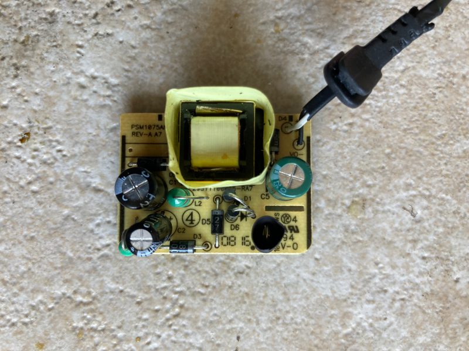
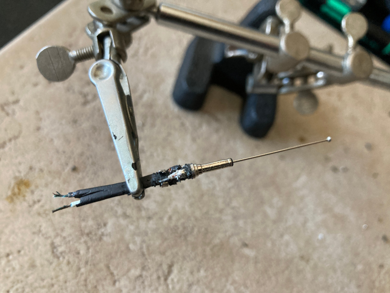
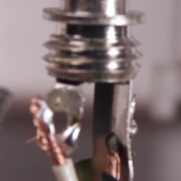
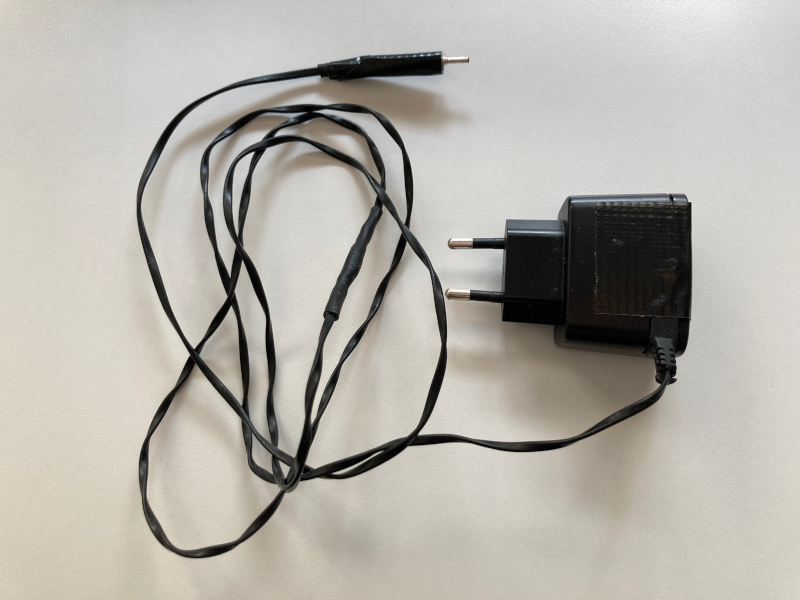

# Repairing a phone charger

This was my first non-trivial electronic repair, as well as my first soldering experience. Despite not being about software, fault tracing in electrical circuits can be of interest, as it shares similarities with debugging.

## Overview

A dumbphone charger stopped charging. After a quick look along the cable, there was a noticeable bump where the cable comes out of the charger's case. This bump would have to be cut off, and since it was so close to the ends soldered on the circuit, we would have to first desolder the cable.

## Challenges

* Tutorials usually [only tell part of the story](https://en.wikipedia.org/wiki/Curse_of_knowledge), and there's **additional requirements or context-specific steps** to take (for example, does a tutorial on wiring an audio connector mention that you should re-tin your iron before using it? maybe this is considered out-of-scope, but if it's a tutorial aimed at beginners, most likely beginners need references to pre-required knowledge). Of course, this is all figured out after mistakes are made...
* To acquire materials in a country where English isn't the main language, we need to **translate technical terms to another language**. However, online translators sometimes fail to be accurate.
    * I've found myself going to an online store from my country, filtering for relevant categories, and just scrolling the results until I find the item.
    * In contrast with software, hardware has a visual representation, so if you know how something looks but not its name, throwing vague terms at google images may lead you to listings with more accurate terms.

## Setup

Let's start with opening the case. There's some **adorable screws that require a tri-wing screwdriver**. You might think about [making use of another screwdriver](https://www.youtube.com/watch?v=tDvfEQC8iv8), but I've found that not only you need a tiny specific size that multiple piece kits don't come with (= having to buy the dedicated piece), and even if you do have it, you might just end up chewing the screw (= just buy the right tool for the job).

**For soldering PCBs**, we can use [Sn60Pb38Cu2 solder, along with resin-based flux](https://www.youtube.com/watch?v=6rmErwU5E-k). To remove existing solder joints, that solder gets attached to a desoldering wick. Heat is also applied to remove or make new joints, using a soldering iron. I grabbed 2 that I had lying around. They sported a label with distinct wattage ratings. **What wattage should be used with PCBs?** Apparently [around 25-30W](https://www.hellopractical.com/how-hot-does-a-soldering-iron-get/), so both were a fit.

* **Turned one of them on, smoke kept coming off** for several minutes, did it had a defect? [It depends](https://www.reddit.com/r/AskElectronics/wiki/soldering#wiki_i_have_just_plugged_in_my_new_soldering_iron_.28or_replaced_the_tip.29_and_it.2019s_smoking.21_is_this_normal.3F), but it didn't seem to subside, so I went with the one that was less intent in burning down my house...
* After using the iron for a few minutes, I was surprised to see the **tip get burned**. Apparently, there's some preparation work to be done, consisting of [re-tinning the tip](https://www.youtube.com/watch?v=2VlvjdaMARM).
* But with the tip containing burned materials on the surface, **I couldn't re-tin it since solder wouldn't attach** to the surface. I ended up [cleaning the surface with a brass brush](https://www.youtube.com/watch?v=7PWmMxjXwYE), in the hopes that it wouldn't scrape too much of the [iron plating](https://en.wikipedia.org/wiki/Soldering_iron#Cleaning). If that happens, then the copper core is exposed, which solder also doesn't attach to.
* To clean the tip during use, I bought a huge cellulose sponge that I cut after a chunk gets dirty. It's probably **not the right material, as it gets easily burned**, and those burned leftovers may eventually get in the tip, requiring scrubbing again with the brush... for now I just avoid cleaning on top of burned areas.

For **fault tracing**, we need a way to make the internal state of our electrical components explicit. This is achieved by using a multimeter. In software, we can use netcat to check the connectivity between hosts. In hardware, an equivalent would be the multimeter's continuity test, where we check the connectivity between two points in a closed circuit. Since we believe our charger's cable to have a broken wire, this test should return no connectivity.

## Analysis

The cable is composed of 2 wires: black for negative charge, white for positive charge. The PCB even labels them as such:

 <i>Labels for `V0-` and `V0+` next to the cable's solder joints. Note the bump in the cable at the top-right.</i>

With one of the multimeter's probe touching the outside of the connector plug, and the other on the black wire's solder joint, we have continuity. But when moving to the other wire and trying to test the inside of the connector plug, the **probe wouldn't fit in**. No worries, we can stick a metal pin inside it and hold the probe to the pin, while placing the other probe on the white wire's solder joint. And... no continuity on this case!

After desoldering the cable, cutting the part with the bump, and stripping the cut cable end to have the copper exposed, we repeat the test for each wire. Still, no continuity for the white wire.

At this point, we could do a **bisect** approach: cut the wire in half, check which part doesn't have continuity, cut that part in half, and repeat until the fault is identified.

I cut once in half, confirming that the **part with the plug had no continuity**. Given that no other bump could be felt across the cable, it must be an issue inside the plug. Keeping up with the tradition of being adversarial to repairs, the plug was glued shut, so cue-in some enthusiastic use of cutters:

 <i>Among the damage, there's a bump right before where the white wire is soldered.</i>

Now that both wire ends were exposed, placing probes on each end of the white wire confirmed no continuity, so we could definitely blame another bump.

I couldn't find a replacement plug with the same diameter, so this one had to be reused. It was a matter of [resoldering the plug](https://www.youtube.com/watch?v=MjMSnja8aDk) with the broken end cut off:

 <i>Soldering wire ends to a DC plug.</i>

To **isolate the cable and plug**, I used heat-shrink tubing.

Finally, besides doing the continuity test, we wanted to be sure the charger [still output the same voltage as advertised in its label](https://superuser.com/questions/455108/can-i-use-a-power-brick-with-higher-voltage-for-my-monitor). When doing a voltage test with the multimeter, I found that it had a **higher output voltage reading**.

* Could it be from the shorter wire? After all, less wire meant less resistance, so higher voltage, as given by Ohm's law. However, the [cable's resistance is too small](https://electronics.stackexchange.com/questions/465901/will-current-usage-increase-with-different-length-of-wire) to be significant.
* Apparently there are two types of power adapters: regulated and unregulated, where the latter's output varies according to used current, so it should be [measured with minimum load](https://electronics.stackexchange.com/questions/5759/is-it-normal-for-dc-wall-adapter-power-supplies-to-provide-voltages-above-the-no). Indeed, I had only plugged the charger to the socket, so there was no load applied when measuring with the multimeter.

With that clarified, the last test was charging the dumbphone itself, which worked as expected.

 <i>Ta-da.</i>

## Closing thoughts

* _Why didn't you just buy another charger, saving you time and money?_ Then I wouldn't learn! Besides, good luck finding this obsolete model or a generic model with the right combination of output voltage and plug diameter.
* _Did you know that if your house burns down because of your hacked charger, insurance companies won't give you a dime?_ Well, better keep an eye on it...
