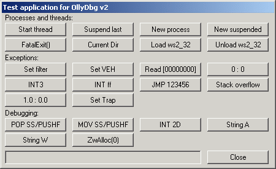

# +

- [batch](batch.md)
- [powershell](powershell.ps1)
- [rdp](./rdp.md)
- [wmi](./wmi.md)

- [WADComs](https://wadcoms.github.io/)
- [xCyclopedia - The Encyclopedia for Executables - STRONTIC](https://strontic.github.io/xcyclopedia/#index)
- [GitHub \- harryanon/r0ak \-  read, write, and execute kernel-mode code from the command prompt](https://github.com/harryanon/r0ak)
- [GitHub \- Ondrik8/exploit \- Advanced Windows exploit development resources](https://github.com/Ondrik8/exploit)

- [OSR Developer Community](https://community.osr.com/)
- [theForger's Win32 API Tutorial](http://www.winprog.org/tutorial/)
- [Programming reference for the Win32 API \- Win32 apps \| Microsoft Docs](https://docs.microsoft.com/en-us/windows/win32/api/)

```
get-command notepad.exe | select Source
for %i in (java.exe) do @echo. %~$PATH:i
dir /s /b c:\*java.exe

cd HKCU:\

shutdown /r /t 0

findstr /I /S /P /C:"foo" *
dir /s/b *.wsdl

tasklist /fi "pid eq 15004"
taskkill /IM firefox.exe /F
taskkill /PID 26356 /F

https://www.sans.org/security-resources/sec560/windows_command_line_sheet_v1.pdf
https://www.lemoda.net/windows/windows2unix/windows2unix.html

wget "_" -Verbose | select -ExpandProperty "Headers"

ffmpeg -f gdigrab -framerate 30 -i desktop output.mkv

./Windows/Microsoft.NET/Framework/v4.0.30319/ASP.NETWebAdminFiles/web.config
./Windows/Microsoft.NET/Framework/v4.0.30319/Config/web.config

icacls Download /deny Everyone:(OI)(IO)(X)

# SMB
\\live.sysinternals.com\tools\PsExec.exe -s -c cmd.exe
# WebDav over HTTPS
net use z: hxxps://live.sysinternals.com/tools && z:\PsExec.exe -s -c cmd.exe
```

```ps1
gci env:*
$env:Path.split(';')

[Environment]::SetEnvironmentVariable("k", "v", "User")

Get-Command _ | Select-Object -ExpandProperty Definition

[System.Net.ServicePointManager]::CertificatePolicy | Get-Member -Type All
[System.Reflection.Assembly]::GetAssembly([System.Net.ServicePointManager]::CertificatePolicy.GetType()) | Format-Table -Wrap

# == ls -ltr
dir | Sort-Object LastAccessTime

# https://winaero.com/blog/find-hard-disk-serial-number-windows-10/
# https://superuser.com/questions/498083/how-to-get-hard-drive-serial-number-from-command-line
GWMI -namespace root\cimv2 -class win32_volume | FL -property DriveLetter, DeviceID
Get-WmiObject Win32_volume | Format-table Name, @{Label = "SerialNumber"; Expression = {"{0:X}" -f $_.SerialNumber}}  -auto
Get-WmiObject Win32_logicaldisk | Format-table Name, volumeserialnumber

# detect vm
Get-WmiObject -Class "Win32_computersystem" | Select-Object *
gwmi Win32_BaseBoard

# detect 32/64 bits, os version
gwmi win32_operatingsystem | select osarchitecture
```

```
vol
mountvol

REG QUERY HKLM\Software\Microsoft\Windows\CurrentVersion\DateTime\Servers
w32tm /query /configuration
w32tm /monitor
w32tm /config /manualpeerlist:x.x.x.x /syncfromflags:manual /update
w32tm /resync /force

w32tm /config /syncfromflags:domhier /update
Restart-Service w32time
```

C:\WINDOWS\Microsoft.Net\assembly\GAC_MSIL\System\v4.0_4.0.0.0__b77a5c561934e089\System.dll

https://docs.microsoft.com/en-us/powershell/module/microsoft.powershell.utility/get-member?view=powershell-6

https://github.com/d1pakda5/PowerShell-for-Pentesters/blob/master/20-Remoting-Part-1.md

> PowerShell functions. These are easy, since the function "is" the source code. You can do something like this to open the file up in the ise, if the command is a function: powershell_ise (Get-Command Get-CMSoftwareUpdate).ScriptBlock.File
> Cmdlets. These are .NET classes, usually written in C#. Unless the source code is open-source, you can't get its original form, but you can decompile back to a somewhat-readable C# file using free tools such as ILSpy or DotPeek. If it's a cmdlet, you can find the file that needs to be decompiled like this: (Get-Command Get-CMSoftwareUpdate).ImplementingType.Assembly.Location
> CIM commands. These are auto-generated PowerShell wrappers around WMI classes; they're generated from cdxml files in the module directory. I'm not sure if there's an easy way to open an individual command's file, but once you know that's what you're dealing with, you can browse to the module's folder and open up the cdxml files to see what it's doing.

https://stackoverflow.com/questions/54787115/how-to-debug-a-windows-kernel-driver-properly
https://github.com/Microsoft/Windows-driver-samples/tree/master/filesys/miniFilter/minispy

https://github.com/janosgyerik/cheatsheets/blob/master/Windows-cheat-sheet.mediawiki

# vms

https://developer.microsoft.com/en-us/windows/downloads/virtual-machines

# modify disk partition

diskmgmt.msc
disable virtual memory

# network packet sniffer

fiddler

# debug 

- process lifecycle (threads, exceptions, exit...)
    - OllyDbg Test.exe
        - 
- crash dump, memory dump
    - https://docs.microsoft.com/en-us/windows/win32/wer/collecting-user-mode-dumps
    - https://channel9.msdn.com/Shows/Defrag-Tools/Defrag-Tools-15-WinDbg-Bugchecks

# WMI event handlers

https://technet.microsoft.com/en-us/library/ff898417.aspx

# Verbatim Path Syntax

```
\\?\C:\Temp\COM2.TXT
```

# Browse volume over network

Folder Options > View > Uncheck `Use simple file sharing`

```
\\192.168.1.1\C$
```

# Admin privileges

boot repair disk
    replace `C:\Windows\System32\sethc.exe` with `C:\Windows\System32\cmd.exe`

# Disabled command prompt

.bat file
powershell
https://portableapps.com/apps/utilities/command_prompt_portable
https://forum.raymond.cc/threads/re-enable-project-ideas-and-suggestions.12672/
remove HKEY_CURRENT_USER\Software\Policies\Microsoft\Windows\System\DisableCMD DWORD 0

# reserved names, special devices, metadata

file:///c:/con/con
c:\con\con
c:\$MFT\123

# fix NTFS corruption

```bash
# From: sudo fdisk -l
sudo ntfsfix /dev/sdb1
# ||
chkdsk /R
# ||
chkdsk /scan
chkdsk /spotfix
```

# NTFS alternative data streams (ADS)

- aka. extended attributes
- format: filename:streamname

```
dir /r

|| unix
sudo mount -t ntfs foo /mnt/foo
getfattr --only-values FILE0

|| browser
file:///C:/foo.txt:FILE0:$DATA
```

# ext4

```
wmic diskdrive list brief
wsl --mount \\.\PHYSICALDRIVE0
```

# windows update

```ps1
# https://docs.microsoft.com/en-us/windows/deployment/update/windows-update-troubleshooting
# https://docs.microsoft.com/en-us/windows/deployment/update/windows-update-logs
# - C:\Windows\Logs\WindowsUpdate\windowsupdate.log
# - C:\ProgramData\USOShared\Logs\UpdateSessionOrchestration.etl
# - C:\ProgramData\USOShared\Logs\NotificationUxBroker.etl
# - $env:systemroot\Logs\CBS\CBS.log
# - $env:windir\System32\catroot2\edb.log

# portable os
# https://superuser.com/questions/1319046/how-do-i-update-windows-10-that-is-installed-on-an-external-hard-disk
# - HKEY_LOCAL_MACHINE\SYSTEM\CurrentControlSet\Control

# oom - run separate svchost processes
# https://www.reddit.com/r/sysadmin/comments/3w1kfp/windows_update_is_broken_for_w7_x64_ent_wsp1_and/cxso3r4/
sc.exe config wuauserv type= own
winmgmt /standalonehost

# supersedence chain

# snapshot - checksums for enumerated files

Get-WindowsUpdateLog

net stop cryptsvc
rename $env:systemroot\system32\catroot2 $env:systemroot\system32\catroot2.bak
net start cryptsvc

net stop wuauserv
net stop bits
rename $env:windir\SoftwareDistribution $env:windir\SoftwareDistribution.bak
net start bits
net start wuauserv

# remove installed package
wusa /uninstall /KB:1234
```

# demand-paging model

page directory composed of hierarchy of page tables
    :) efficient handling empty segments of sparse data - only allocates page tables when needed
follow page tables, extract pte, fetch data from ram || hdsk
os compresses memory to maximize ram storage

# dump non public static functions in asemblies

```ps1
ForEach ( $assembly in [AppDomain]::CurrentDomain.GetAssemblies() ) {
    $name = $assembly.FullName.Split(',')[0].ToLower() -Replace('\.',"-")
    $loadTypes = $assembly.GetTypes()
    ForEach ( $type in $loadTypes ) {
        $methods = $type.GetMethods([Reflection.BindingFlags] 'NonPublic, Static') | select -expand Name
        $typeName = $type.FullName
		$outFileName = $name + "." + $typeName
		$assemblyDir = Join-Path (Get-location).Path "assembly"
        $outputFile = Join-path $assemblyDir "${outFileName}"
        Write-Output $methods | out-file -encoding ascii $outputFile
    }
}
```

# File System Redirector

calls to C:\Windows\system32 from 32-bit process redirected to SysWOW64
calls to C:\Windows\Sysnative from 32-bit process redirected to system32 (64 bit)

https://twitter.com/swiftonsecurity/status/988909127006085123

# profiling

On `procmon` GUI:

- Tools > Profiling Events
- Tools > Stack Summary
- Select: table header > Select Columns > Check: Duration

On `procmon` CLI:

```
procmon /quiet /minimized /backingfile c:\temp\trace.pml
# [reproduce issue...]
procmon /terminate
```

# ptrace equivalent

- ETW
    - StartTrace, EnableTrace
        - ~/code/snippets/windows/etw-trace.cpp
        - [Configuring and Starting the NT Kernel Logger Session \- Win32 apps \| Microsoft Docs](https://docs.microsoft.com/en-us/windows/win32/etw/configuring-and-starting-the-nt-kernel-logger-session?redirectedfrom=MSDN)
    - EVENT_TRACE_FLAG_SYSTEMCALL flag: Enables SysCallEnter and SysCallLeave events
        - [SysCallEnter class \- Win32 apps \| Microsoft Docs](https://docs.microsoft.com/en-us/windows/win32/etw/syscallenter?redirectedfrom=MSDN)

# installers

EXE
    ```ps1
    # Extract wrapped MSI file
    setup.exe /a
    setup.exe /x
    setup.exe /extract
    ```
MSI - COM-structured storage files, including database
    https://stackoverflow.com/questions/48482545/how-can-i-compare-the-content-of-two-or-more-msi-files/48482546#48482546
    ```ps1
    # Convert to wxs xml
    $OutputFolder=
    dark.exe -x $OutputFolder MySetup.msi
    ```
NSIS (Nullsoft Scriptable Install System)
    /S - run silently
    /D - default installation directory
    https://www.exemsi.com/documentation/installer-frameworks/nsis-nullsoft-scriptable-install-system/

parsing
orca
    Tables > Property
    => Values for public properties
    ||
    Transform > New Transform
    [ Apply Modifications... ]
    Transform > Generate Transform
    => MST file
    ```ps1
    cscript WiUseXfm.vbs $OriginalDatabase $TransformFile $Options
    ```
automating widget manipulation
https://pywinauto.readthedocs.io/en/latest/
https://www.autohotkey.com/docs/commands/ControlGet.htm
    :( Some applications store their ListView text privately, which prevents their text from being retrieved
    e.g. https://autohotkey.com/board/topic/48481-selecting-item-in-combobox/

automating silent install parameters
https://stackoverflow.com/questions/46221983/how-can-i-use-powershell-to-run-through-an-installer
    msiexec.exe /I "C:\Your.msi" /QN /L*V "C:\msilog.log" TRANSFORMS="C:\1031.mst;C:\My.mst"
        https://stackoverflow.com/questions/458857/how-to-make-better-use-of-msi-files/1055861#1055861
        https://stackoverflow.com/questions/54761131/change-the-value-of-a-msi-property-loaded-from-a-dll-using-a-msi-transform/54769767#54769767
        https://docs.microsoft.com/en-us/windows/win32/msi/transforms
    || public properties
    msiexec.exe /I "C:\Your.msi" /QN /L*V "C:\msilog.log" PARAM1="VALUE1" PARAM2="VALUE2"
https://docs.microsoft.com/en-us/windows/win32/msi/standard-installer-command-line-options
https://docs.microsoft.com/en-us/windows/win32/msi/command-line-options

case studies
    chocolatey
    https://github.com/microsoft/winget-pkgs

# libraries, dll

types
    Visual C++ - Microsoft Foundation Class (MFC) library
        wraps Win32 API calls
        On VC:
        - Configuration Properties > General > Use MFC in static library
        - C/C++ > Code generation > Runtime Library > Multi Threaded Debug
    extension DLL
        derived classes from MFC, built using dynamic-link MFC library
        https://github.com/Microsoft/VCSamples/tree/master/VC2010Samples/MFC/advanced/dllhusk
        https://docs.microsoft.com/en-us/cpp/build/extension-dlls-overview?view=vs-2019
linker pipeline
    .def -(build)-> .exp, .lib
    .exp -(build)-> .dll
exports
    .dll `__declspec(dllexport)` - by name
        import section -(contains)-> .def
    .lib (import library) - by ordinal, assigned automatically, matches function names with ordinals, static library, = stub
        :) enables cross-platform builds (e.g. 64-bit target on 32-bit environment), build for different version of dll given corresponding sdk
        https://stackoverflow.com/questions/1297013/why-do-we-still-need-a-lib-stub-file-when-weve-got-the-actual-dll-implementat
    .def (module-definition) - by ordinal, assigned manually
        :) maintains same ordinals, .lib still valid, no need for apps to relink with .lib
        NONAME attribute - export table stores ordinals instead of function names
            ```c
            const WORD AfxEnableMemoryLeakDumpOrdinal = 15902;
            GetProcAddress( GetModuleHandle( ... ), (LPCSTR)AfxEnableMemoryLeakDumpOrdinal );
            ```
            https://stackoverflow.com/questions/11412650/calling-afxenablememoryleakdump-for-a-specific-mfc-dll
        generated by - https://docs.microsoft.com/en-us/cpp/mfc/reference/mfc-dll-wizard?view=vs-2019
        c++ decorated names (aka. name mangling)
            parsed by - dumpbin, linker /MAP, undname ?func1@a@@AAEXH@Z
            https://docs.microsoft.com/en-us/cpp/build/reference/decorated-names?view=vs-2019
            https://stackoverflow.com/questions/27824102/how-do-import-libraries-work-and-why-doesnt-mingw-need-them
        https://docs.microsoft.com/en-us/cpp/build/exporting-from-a-dll-using-def-files?view=vs-2019
        ```
        # match ordinal with symbol name
        dumpbin /HEADERS ...\vc98\mfc\lib\MFC42.lib
        # dump symbol names
        dumpbin /EXPORTS foo.dll
        ```
    https://docs.microsoft.com/en-us/cpp/build/exporting-functions-from-a-dll-by-ordinal-rather-than-by-name?view=vs-2019
    https://stackoverflow.com/questions/49157641/pros-and-cons-of-using-def-files
    ui. exports generation depends on sequence of parsed ordinals in .dll and .pdb [MFC42D\.DLL Ordinal vs Name Question · Issue \#316 · NationalSecurityAgency/ghidra · GitHub](https://github.com/NationalSecurityAgency/ghidra/issues/316)
using exported symbols
    LoadLibrary, GetProcAddress - take function addresses from DLL export section manually
logging calls
    proxy dll, dll redirection
    https://stackoverflow.com/a/32959212

# fullscreen vs. windowed

- https://doxygen.reactos.org/d7/de9/sdk_2include_2psdk_2ddraw_8h_source.html
- https://docs.microsoft.com/en-us/windows/win32/api/winuser/nf-winuser-createwindowexa
    - https://docs.microsoft.com/en-us/windows/win32/winmsg/window-styles
        - WS_OVERLAPPED = 0x00000000L
        - WS_POPUP = 0x80000000L
    - https://docs.microsoft.com/en-us/windows/win32/winmsg/extended-window-styles
        - WS_EX_LEFT = 0
    - https://docs.microsoft.com/en-us/windows/win32/api/winuser/nf-winuser-showwindow
        - SW_NORMAL = 1
- https://docs.microsoft.com/en-us/windows/win32/api/ddraw/nf-ddraw-idirectdraw7-setcooperativelevel
    - IDirectDraw_SetCooperativeLevel(lpDirectDraw, hWnd_, DDSCL_NORMAL);
        - DDSCL_NORMAL = 0x00000008
        - DDSCAPS_PRIMARYSURFACE = 0x00000200
- [DDSURFACEDESC structure \(Windows Drivers\) \| Microsoft Docs](https://docs.microsoft.com/en-us/previous-versions/windows/hardware/drivers/ff550339(v=vs.85))
- [DDSCAPS structure \(Windows Drivers\) \| Microsoft Docs](https://docs.microsoft.com/en-us/previous-versions/windows/hardware/drivers/ff550286(v=vs.85))
- https://stackoverflow.com/questions/16865913/creating-a-simple-single-buffer-application-idirectdraw
    - IDirectDraw_CreateSurface(lpDirectDraw, &ddSurfaceDesc, &lpDirectDrawPrimarySurface, NULL);
        - ddSurfaceDesc.dwSize         = sizeof ddSurfaceDesc;
        - ddSurfaceDesc.dwFlags        = DDSD_CAPS;
        - ddSurfaceDesc.ddsCaps.dwCaps = DDSCAPS_PRIMARYSURFACE;
            - DDSD_CAPS = 0x00000001
    - [!] if no backbuffer, then GetAttachedSurface(&ddscaps,&lpddsback) returns DDERR_NOTFOUND
    - [!] if windowed, then backbuffer can't be flipped
      - [DDraw Windowed \- Graphics and GPU Programming \- GameDev\.net](https://www.gamedev.net/forums/topic/119907-ddraw-windowed/)
      - [Moving from Exclusive Mode to Windowed Mode in DirectX Part I \- Graphics and GPU Programming \- Tutorials \- GameDev\.net](http://www.gamedev.net/reference/articles/article960.asp)
      - [Moving from Exclusive Mode to Windowed Mode in DirectX Part II \- Graphics and GPU Programming \- Tutorials \- GameDev\.net](http://www.gamedev.net/reference/articles/article1034.asp)
      > What you do in windowed mode is Blt() from your backbuffer (simply an offscreen surface) to the primary buffer.  Since the Blt() will overwrite what''s already on the primary surface, the behaviour is different, but that should only be an issue for you if your app relies on the back buffer containing the previous primary buffer contents.  Instead it simply contains the previous backbuffer contents.

# injection, hooks

https://www.codeproject.com/Articles/4610/Three-Ways-to-Inject-Your-Code-into-Another-Proces
https://www.jitsumibooster.com/blogs/jitsumi/cyber-security/injection-methods/62/

mitigations
    https://www.fortinet.com/blog/industry-trends/a-crash-course-in-dll-hijacking.html
        registry - SafeDLLSearchMode
    https://github.com/notepad-plus-plus/notepad-plus-plus/commit/b869163609473f05c4f5d1d72a579b9f6af66ccd
        api - CryptQueryObject(), CertFindCertificateInStore(), CertGetNameString() ==  "Notepad++"
    https://docs.microsoft.com/en-us/windows/win32/api/libloaderapi/nf-libloaderapi-setdefaultdlldirectories
        api - SetDefaultDllDirectories(), AddDllDirectory(), RemoveDllDirectory()
    https://docs.microsoft.com/en-us/security-updates/securityadvisories/2010/2269637

# kerberos

https://serverfault.com/questions/529448/track-down-which-process-program-is-causing-kerberos-pre-authentication-error-c
http://stevenhollidge.blogspot.com/2012/05/troubleshooting-kerberos-with-tools.html

# rsync alternative

robocopy
! limit bandwidth
    delay = filesize / 64KB * IPG (Inter Packet Gap)
    http://www.zeda.nl/index.php/en/copy-files-on-slow-links
    http://blog.nold.ca/2015/07/limiting-bandwidth-using-robocopy.html

# disable features

https://github.com/W4RH4WK/Debloat-Windows-10
https://github.com/Disassembler0/Win10-Initial-Setup-Script

# break on syscall

1. watch process
2. on syscall, attach to cdb
3. handle syscall
4. kill cdb

# font settings

Control Panel > Adjust ClearType text
Settings > Display > Scale and layout
Settings > Display > Advanced display settings > Advanced sizing of text and other items

# python executables

```bash
sudo apt-get install winetricks
winetricks python26
wget https://www.python.org/ftp/python/2.7.13/python-2.7.13.msi
wine msiexec /i python-2.7.13.msi /L*v log.txt
wine ~/.wine/drive_c/Python27/Scripts/pyinstaller.exe --onefile test.py
```

# bloat, telemetry

```
reg add "HKEY_CURRENT_USER\SOFTWARE\Policies\Microsoft\Windows\Explorer" /v "DisableSearchBoxSuggestions" /t REG_DWORD /d 1 /f
```

# Paths, Shortcuts

```
%USERPROFILE%\AppData\Roaming\Microsoft\Windows\Start Menu\Programs\Startup
%AppData%\Microsoft\Windows\Start Menu\Programs\Startup
C:\ProgramData\Microsoft\Windows\Start Menu\Programs\Startup
%AppData%\Microsoft\Internet Explorer\Quick Launch\User Pinned\TaskBar
C:\ProgramData\Microsoft\Internet Explorer\Quick Launch\User Pinned\TaskBar

%USERPROFILE%\AppData\Roaming\Mozilla\Firefox\Profiles

%USERPROFILE%\AppData\Local\Google\Chrome\User Data\Default\Extensions*
`grep 'foo\|bar' Extensions` > hashes
chrome://extensions > Load unpacked extension... > hash1/version1,hash2/version2...

%windir%\system32\cmd.exe /c "D:\foo.cmd"

//VBOXSVR/z
```

### Forbidden names

HKEY_LOCAL_MACHINE\SOFTWARE\Microsoft\Windows\CurrentVersion\Explorer\FileAssociation\AddRemoveNames

# Special Folders, URL Monikers

```
start shell:RecycleBinFolder

regedit /e C:\folderDescriptions 'HKEY_LOCAL_MACHINE\SOFTWARE\Microsoft\Windows\CurrentVersion\explorer\FolderDescriptions'
```

https://docs.microsoft.com/en-us/previous-versions/windows/internet-explorer/ie-developer/platform-apis/ms775149(v=vs.85)
https://stackoverflow.com/questions/3605148/where-can-i-learn-about-the-shell-uri

# Restart Shell

taskmgr.exe (Task Manager) > File > Run New Task > explorer.exe

# Task Scheduler

https://docs.microsoft.com/en-us/previous-versions/windows/it-pro/windows-server-2000/bb726974(v=technet.10)
"C:\WINDOWS\system32\mmc.exe" C:\WINDOWS\system32\taskschd.msc

# Event Viewer

```
eventvwr
```

Computer management > System Tools > Event Viewer > Windows Logs > System

# Certificates, Policies

```
certmgr.msc
gpedit.msc
gpupdate
```

### Prevent exe from running

ClickToRunSvc

https://docs.microsoft.com/en-us/previous-versions/technet-magazine/cc510322(v=msdn.10)

User Configuration > Administrative Templates > System > Don't run specified Windows applications
Software\Policies\Microsoft\Windows\EventLog\Security\System

# Process using file

```
resmon
perfmon > CPU > Associated Handles
```

# Process Monitor, env vars of process

- Operation is Process Create
- Operation is Process Start
- Sort Column => Tools > File Summary

# Process Monitor, file access

- Operation is ReadFile
- Operation is WriteFile
- Path contains ...

# Network, Hosts, IP

```ps1
netstat -bano

ipconfig /flushdns

getmac
ipconfig -all
nbtstat -A $IP
ping -a $IP
nslookup $IP
```

# Disable warnings

```
REG ADD HKCU\Software\Microsoft\Windows\CurrentVersion\Policies\Explorer /v NoLowDiskSpaceChecks /t REG_DWORD /d 1
```

# Allow remove/uninstall program

HKLM\SOFTWARE\Microsoft\Windows\CurrentVersion\Uninstall

# DHCP

```
REG ADD HKLM\SOFTWARE\Microsoft\NetSh /v dhcpmon /t REG_SZ /d dhcpmon.dll

netsh dhcp server 10.254.64.188 show clients 1
netsh -r 10.254.64.188 dhcp server dump
```

https://www.microsoft.com/en-us/download/details.aspx?id=45520

# Routing and Remote Access

```
net stop dns; net start dns; net stop remoteaccess; net start remoteaccess
```

# Clear cached credentials

```
net use * /delete
klist purge

cmdkey /delete:targetname
    batch script to iterate through targets

rundll32.exe keymgr.dll,KRShowKeyMgr
```

# Run as another user credentials

```ps1
$username = 'user'
$password = 'password'

$securePassword = ConvertTo-SecureString $password -AsPlainText -Force
$credential = New-Object System.Management.Automation.PSCredential $username, $securePassword
Start-Process Notepad.exe -Credential $credential

# ||
Start-Process powershell.exe -Credential $Credential -Verb RunAs -ArgumentList ("-file $args")
Start-Process -Verb RunAs powershell.exe -Args "-executionpolicy bypass -command Set-Location \`"$PWD\`"; .\install.ps1"
Powershell.exe -ExecutionPolicy Bypass -NoLogo -NonInteractive -NoProfile -WindowStyle Hidden -File .\Install.ps1
```

# Language bar

```
ctfmon.exe
```

# Registry

```
reg query HKLM /f foo /t REG_SZ /s
reg query HKCU /f foo /t REG_SZ /s

regedit /e C:\dump.txt "HKEY_LOCAL_MACHINE\SYSTEM"
```

# flags, compatibility mode

HKEY_LOCAL_MACHINE\Software\Microsoft\Windows NT\CurrentVersion\AppCompatFlags\Layers

# event tracing

```
logman start "NT Kernel Logger" –p "Windows Kernel Trace" (process,thread,img,disk,net,registry) –o systemevents.etl –ets
logman stop "NT Kernel Logger" –ets
tracerpt systemevents.etl

logman start -ets mywinsocksession -o winsocklogfile.etl -p Microsoft-Windows-Winsock-AFD
logman stop -ets mywinsocksession
tracerpt winsocktracelog.etl –o winsocktracelog.txt
```

# tcp, connection

```
netstat -t
```

https://blogs.technet.microsoft.com/nettracer/2010/08/02/have-you-ever-wanted-to-see-which-windows-process-sends-a-certain-packet-out-to-network/
https://docs.microsoft.com/en-us/sysinternals/downloads/tcpview

https://community.microstrategy.com/s/article/KB16328-How-to-enable-and-configure-Keep-Alive-options-for
HKLM\SYSTEM\CurrentControlSet\Services\Tcpip\Parameters

# dns

- Can ping dns server, can't resolve addresses
    - DNS Manager > Properties > Interfaces > Listen on: Only the following IP addresses: $VPN_IP

# run as current login user

1. C:\Windows\System32\runas.exe /user:CORPPRO\776079E /savecreds cmd.exe
2. D:\msys2-32bits\msys2.exe > start cmd

# wireless password

```
netsh.exe wlan show profiles name='Profile Name' key=clear
```

# import root certificates

```ps1
$files = Get-ChildItem -File .\*; foreach ($f in $files) { Import-Certificate -FilePath $f.FullName -CertStoreLocation Cert:\LocalMachine\Root }
# ||
certutil -addstore -user "Trusted Root Certification Authorities" cert.pem
```

# groups

```
gpresult /v
gpresult /r
whoami /groups
net user USERNAME /domain
```

# file handlers

https://blogs.technet.microsoft.com/markrussinovich/2009/09/29/pushing-the-limits-of-windows-handles/
https://stackoverflow.com/questions/31108693/increasing-no-of-file-handles-in-windows-7-64-bit

# Environment Variables

https://en.wikipedia.org/wiki/Environment_variable#Windows

# Windows Defender Firewall with Advanced Security

```ps1
wf.msc
netsh advfirewall firewall dump
```

# Disable Windows Defender

```ps1
Set-MpPreference -DisableRealtimeMonitoring $true
```

# Test WMI access

https://support.infrasightlabs.com/article/how-to-confirm-winrm-and-remote-scripting/

```ps1
# WMI access through DCOM (default)
New-CimSession -ComputerName REMOTEMACHINE -SessionOption (New-CimSessionOption -Protocol Dcom) -Credential "MYDOMAIN\MYUSER"

# WMI access through DCOM
Get-WmiObject -ComputerName REMOTEMACHINE -Credential "MYDOMAIN\MYUSER" -Query "SELECT * FROM Win32_ComputerSystem"

# WinRM access
Test-WSMan -ComputerName REMOTEMACHINE -Credential "MYDOMAIN\MYUSER" -Authentication default

# WMI access through WinRM
Get-WSManInstance -ComputerName REMOTEMACHINE -Credential "MYDOMAIN\MYUSER" -Enumerate -ResourceURI wmicimv2/* -Filter "SELECT * FROM Win32_ComputerSystem"

# Execute method
$cred = get-credential
Get-WmiObject -class win32_operatingsystem -ComputerName $server -credential $cred |
    Invoke-WMIMethod -name Win32Shutdown -credential $cred -argumentlist @(2)
```

# disasm

```
dumpbin /pdbpath
dumpbin /map foo.exe > foo.map
dumpbin /disasm foo.exe
link.exe /dump /linenumbers /disasm foo.exe
```

https://stackoverflow.com/questions/2451369/how-to-create-a-map-file-from-a-pdb-file
    https://ecs.syr.edu/faculty/fawcett/Handouts/TestingSeminar/Chapter12And14_CodeAndDocs/PDB2MAP.cpp

http://www.geoffchappell.com/studies/msvc/link/dump/options/map.htm?tx=12,27,35,37,46,50&ts=0,3852

# UAC

Disable Windows Security prompt:

- gpedit.msc > Computer Configuration > Administrative Templates > Windows Components > Credential User Interface > Require trusted path for credential entry

- https://www.tenforums.com/tutorials/112476-enable-ctrl-alt-delete-secure-desktop-uac-prompt-windows.html

# "This program is blocked due to compatibility issues"

- gpedit.msc > Computer Configuration > Administrative Templates > Windows Components > Application Compatibility
    - Turn off Application Compatibility Assistant
    - Turn off Application Compatibility Engine

# shares

- https://superuser.com/questions/199387/elevated-command-line-prompt-cant-access-shared-drives
    - https://docs.microsoft.com/en-us/previous-versions/windows/it-pro/windows-server-2008-R2-and-2008/ee844140(v=ws.10)?redirectedfrom=MSDN
- https://nikolar.com/2015/03/10/creating-network-share-with-anonymous-access/
- => cmd.exe > Run as Administrator
    ```ps1
    mklink /d "C:\Users\foo\bar.link" "\\1.2.3.4\c$\tmp"

    fsutil file queryfileid C:\Users\foo\bar.link
    # Error:  The user name or password is incorrect.

    fsutil file queryfileid C:\Users\foo\bar.link
    # File ID is 0x0000000000000000005f000000021246
    ```

# isolation, sandboxing

https://superuser.com/questions/975912/how-can-i-disable-network-access-for-specific-user
https://4sysops.com/archives/windows-10-sandbox-running-applications-in-an-isolated-environment/

# conhost vs csrss

https://stackoverflow.com/questions/1313195/why-is-conhost-exe-being-launched
    http://blogs.technet.com/b/askperf/archive/2009/10/05/windows-7-windows-server-2008-r2-console-host.aspx

# MS Office macros

[GitHub \- decalage2/oletools: oletools \- python tools to analyze MS OLE2 files \(Structured Storage, Compound File Binary Format\) and MS Office documents, for malware analysis, forensics and debugging\.](https://github.com/decalage2/oletools)

# jail

```
# 0xFB switch
# where û is ALT+150 and jut a mapping of Endash in 437 code page
# - https://twitter.com/Hexacorn/status/1300563682854875142
certutil û<command>
```

### bypass disabled cmd prompt

> Open the Wireless Network Connection screen by clicking on the WiFi icon in the bottom right hand corner of the screen. This should be next to the system clock.
> Select "Change advanced settings" – this will bring up a screen called Windows Network Connection Properties. Choose the Wireless Networks tab.
> Under the Preferred networks section, click the Add button and then select the Authentication tab. Make sure "Enable IEEE 802.1x authentication for this network" is enabled.
> Under EAP Type, select "Smart Card or other Certificate" and then click the Properties button.
> Under Trusted Root Certificate Authorities click the View Certificate button. This will bring up a screen called Certificate; choose the Details tab and click the "Copy to File" button. This will bring up a screen called Certificate Export Wizard.
> Click Next and select any of the available export format options. For example, choose the "DER encoded binary X.509" option and click next.
> Instead of typing out a export path click the Browser button to open a file dialog. In the "File Name" box type: \WINDOWS\System32\ and under "Save as type" select the "All Files (*.*)" option. Hit the enter key.
> Locate the cmd.exe file then drag and drop any Dynamic-Link Library (DLL) over it. For example, choose the clusapi.dll file located near the cmd.exe executable. This will open a Command Prompt screen as an unprivileged user.
    - https://blog.korelogic.com/blog/2020/06/29/cellebrite_good_times_come_on

# install xp on hard disk

On Windows host:

- If host is VM: connect disk via hub and passthrough usb hub device

1. MBR partition, NTFS file system, quick format, and set the partition as active (= primary + boot flag set);
2. Mount XP install cd, run `D:\I386\winnt32.exe /syspart:E /tempdrive:E /makelocalsource /noreboot`;
3. Delete `migrate.inf` file from `$WIN_NT$.~BT` directory;
4. Put drive on the destination computer and continue installation normally.
    - If bootloader is GRUB:
        ```
        set root='(hdX,msdosY)'
        chainloader +1
        boot
        ```

- https://bigcat.cl/2020/12/26/how-i-install-windows-xp-on-weird-old-devices/#more-23
- https://www.poweriso.com/tutorials/how-to-make-winxp-bootable-usb-drive.htm

### slipstream drivers

- https://www.nliteos.com

### restore grub

1. Make linux root partition bootable again
    ```
    (parted) print
    # Given partition number = 3
    (parted) set 3 boot on
    ```
2. Install GRUB to MBR
    ```bash
    grub2-install /dev/sda
    ```
3. Add Windows menuentry
    - Automatic: os-detect script
        ```bash
        grub2-mkconfig -o /etc/default/grub.cfg
        ```
    - Alternative: Manual edit
        ```
        menuentry 'Windows Boot Manager' {
            insmod part_msdos
            set root='(hdX,msdosY)'
            chainloader +1
        }
        ```

- https://fedoraproject.org/wiki/GRUB_2


